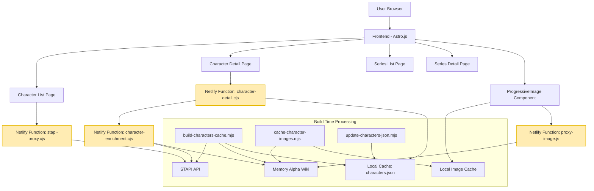
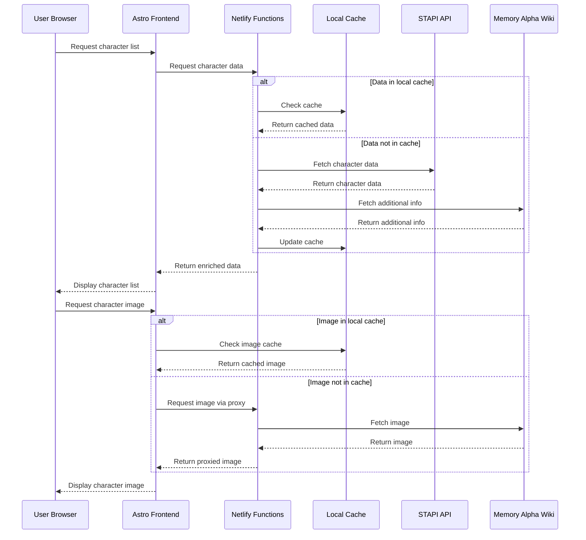
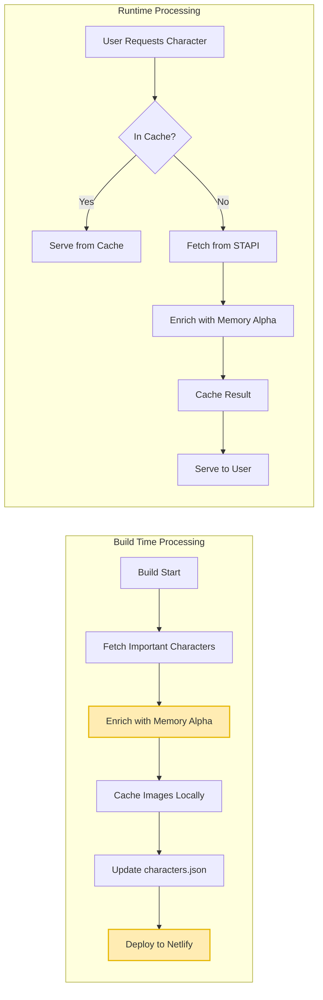

# Star Trek Timelines System Architecture Documentation

## Table of Contents
- [Overview](#overview)
- [System Architecture](#system-architecture)
- [Data Flow](#data-flow)
- [Image Caching System](#image-caching-system)
- [Build vs. Runtime Processing](#build-vs-runtime-processing)
- [Component Details](#component-details)
- [Known Issues and Solutions](#known-issues-and-solutions)
- [Troubleshooting Guide](#troubleshooting-guide)

## Overview

The Star Trek Timelines application is a comprehensive web application that provides information about characters, series, and timeline events in the Star Trek universe. It is built with Astro.js and Tailwind CSS, uses STAPI (Star Trek API) for data, and Memory Alpha wiki for images.

The application handles approximately 7,600 characters, with the first 48 processed at build time and the rest at runtime when requested. All images are cached locally to avoid overloading Memory Alpha with requests.

> ⚠️ **Development Challenge:** The large dataset (7,600+ characters) caused significant build time issues when we tried to process all characters at build time. This led to the hybrid approach we now use.

## System Architecture

The system consists of several key components:



> 🔄 **Recurring Issue:** We've had persistent problems with Netlify function routing. The order of redirects in netlify.toml is critical - specific routes must come before catch-all routes.

### Key Components:

1. **Frontend (Astro.js)**: Handles the user interface and routing
2. **Netlify Functions**: Serverless functions that handle API requests and data processing
   > ⚠️ **Development Challenge:** We faced significant module compatibility issues between CommonJS and ES Modules. We now use `.cjs` extension for Netlify functions and dynamic imports for ES Module dependencies.
3. **STAPI API**: Provides the base character and series data
4. **Memory Alpha Wiki**: Source for character and series images and additional information
   > ⚠️ **Development Challenge:** We had to implement rate limiting, retries, and queueing to avoid overloading Memory Alpha with too many requests.
5. **Local Caches**: Store character data and images for performance
   > ✅ **Solution:** Local caching reduced Netlify build time from 15+ minutes to under a minute.
6. **Build Scripts**: Process data and images at build time

## Data Flow

The data flow in the system follows these paths:



> 🔄 **Recurring Issue:** We've had issues with pagination logic, where the client-side code incorrectly assumed `allCharacters` contained all characters for all pages. We now ensure each page request fetches the correct data.

### Technical Details:

1. **Character Data Request**:
   - The browser requests character data from the Astro frontend
   - The frontend calls the appropriate Netlify function (stapi-proxy.cjs or character-detail.cjs)
   - The function checks the local cache (characters.json)
   - If not in cache, it fetches from STAPI and enriches with Memory Alpha data
   - The enriched data is returned to the frontend
   > ⚠️ **Development Challenge:** We had issues with inconsistent field names (e.g., `important` vs `isImportant`) and duplicate character entries that required deduplication logic.

2. **Image Request**:
   - The ProgressiveImage component requests an image
   - If the image is in the local cache (/public/images/character-cache/), it's served directly
   - If not, the proxy-image.js function fetches it from Memory Alpha
   - The image is returned to the component, which displays it with loading states and fallbacks
   > 🔄 **Recurring Issue:** We've had persistent issues with images not loading due to STAPI 301 redirects and SVG/placeholder images that needed to be filtered out.

## Image Caching System

The image caching system is a critical component that improves performance and reduces dependency on external APIs:

```mermaid
graph TD
    subgraph "Build Time"
        BuildScript[build-characters-cache.mjs] --> FetchChar[Fetch Character Data]
        FetchChar --> EnrichChar[Enrich with Memory Alpha]
        EnrichChar --> CacheScript[cache-character-images.mjs]
        CacheScript --> DownloadImg[Download Images]
        DownloadImg --> StoreLocal[Store in /public/images/character-cache/]
        StoreLocal --> UpdateScript[update-characters-json.mjs]
        UpdateScript --> UpdateJSON[Update characters.json with local paths]
    end
    
    subgraph "Runtime"
        ImgComponent[ProgressiveImage Component] --> CheckCache{Image in Cache?}
        CheckCache -->|Yes| ServeLocal[Serve from Local Cache]
        CheckCache -->|No| ProxyFunc[proxy-image.js Function]
        ProxyFunc --> FetchMA[Fetch from Memory Alpha]
        FetchMA --> ValidateImg{Valid Image?}
        ValidateImg -->|Yes| ReturnImg[Return Image]
        ValidateImg -->|No| FallbackImg[Use Fallback Image]
    end

    classDef issueNode fill:#ffecb3,stroke:#e6b800,stroke-width:2px
    class FetchMA,ValidateImg issueNode
```



> ⚠️ **Development Challenge:** Production builds initially showed blank character images because they couldn't access the enriched `characters.json` with `wikiImage` fields. We implemented the hybrid caching approach to solve this.

### Technical Implementation:

1. **Build Time Processing**:
   - The `build-characters-cache.mjs` script fetches character data from STAPI
   - It enriches important characters with Memory Alpha data
   - The `cache-character-images.mjs` script downloads images from Memory Alpha
   - Images are stored in `/public/images/character-cache/`
   - The `update-characters-json.mjs` script updates characters.json with local image paths
   > ✅ **Solution:** This approach reduced Netlify build time from 15+ minutes to under a minute.

2. **Runtime Processing**:
   - The ProgressiveImage component requests an image
   - If the image is in the local cache, it's served directly
   - If not, the proxy-image.js function fetches it from Memory Alpha
   - If the image fails to load, a fallback image is used
   > ✅ **Solution:** We implemented a reusable `ProgressiveImage` web component that shows a skeleton loader while images are loading and falls back to generic images if loading fails.

3. **Image Proxy Implementation**:
   ```javascript
   // From proxy-image.js
   const imageUrl = event.queryStringParameters.url;
   
   // Validate URL to prevent abuse
   const allowedDomains = [
     'static.wikia.nocookie.net',
     'memory-alpha.fandom.com',
     'vignette.wikia.nocookie.net',
     'www.startrek.com',
     'images.startrek.com',
     'static.stapi.co'
   ];
   
   const isAllowed = allowedDomains.some(domain => imageUrl.includes(domain));
   
   // Fetch the image with proper headers
   const response = await fetch(cleanedUrl, {
     headers: {
       'User-Agent': 'Mozilla/5.0 (Windows NT 10.0; Win64; x64) AppleWebKit/537.36 (KHTML, like Gecko) Chrome/91.0.4472.124 Safari/537.36',
       'Accept': 'image/webp,image/apng,image/*,*/*;q=0.8',
       'Accept-Language': 'en-US,en;q=0.9',
       'Origin': 'https://memory-alpha.fandom.com',
       'Referer': 'https://memory-alpha.fandom.com/'
     }
   });
   ```
   > ⚠️ **Development Challenge:** We needed to use specific headers to bypass referrer policy restrictions on Memory Alpha images.

## Build vs. Runtime Processing

The application uses a hybrid approach to balance build time performance with comprehensive data coverage:



> 🔄 **Recurring Issue:** Netlify build times were a major challenge. Processing all 7,600+ characters at build time caused builds to take 15+ minutes or time out completely.

### Technical Details:

1. **Build Time Processing**:
   - The first 48 characters are processed at build time
   - Character data is fetched from STAPI
   - Images are downloaded from Memory Alpha
   - Data and images are stored in local caches
   - The build process takes minutes instead of hours by limiting the number of characters processed
   - **Deployment:** The repository is connected to Netlify, which automatically deploys changes when they are pushed to the main branch. No manual deploy script is needed.
   > ✅ **Solution:** We created a one-off harvest script (scripts/build-characters-cache.mjs) that fetches all characters from STAPI and enriches important ones with Memory Alpha data.

2. **Series Page Processing**:
   - The series data pipeline consists of three main scripts:
     1. `build-series-cache.mjs`: Fetches basic series data from STAPI and enhances it with Memory Alpha content
     2. `build-series-characters.mjs`: Builds a cache of character data for each series using a combination of STAPI API data and manually curated lists
     3. `build-series-episodes.mjs`: Enhances the series data with episode information from STAPI, organized by season
   - The scripts generate and update the following files:
     - `src/data/series.json`: Contains basic series information and episode data
     - `netlify/functions/series-characters.json`: Contains character data for each series
   - This ensures series pages have complete data at deploy time, including cast and episodes
   > ✅ **Solution:** This approach balances freshness of data with build performance, ensuring series pages have complete data at deploy time.

3. **Runtime Processing**:
   - When a user requests a character not processed at build time, it's processed on-demand
   - The character-enrichment.cjs function fetches data from STAPI
   - It enriches the data with Memory Alpha information
   - The result is cached for future requests
   - This distributes the processing load across user requests
   > ✅ **Solution:** We implemented caching in the character-enrichment.cjs function to avoid redundant API calls.

4. **Caching Strategy**:
   ```javascript
   // From stapiService.js
   async getAllCharacters() {
     try {
       // Check if we have a file cache first
       if (process.env.SKIP_CHAR_CACHE !== 'true' && fs.existsSync(cachePath)) {
         console.log('🟢  Using cached characters.json');
         return JSON.parse(fs.readFileSync(cachePath, 'utf8'));
       }
       
       // If no file cache or SKIP_CHAR_CACHE=true, use in-memory cache
       console.log('🟡  Cache miss – crawling STAPI');
       const cacheKey = 'all_characters_v2';
       return await this.getCachedData(cacheKey, async () => {
         // Fetch characters from STAPI
       }, 3600000); // Cache for 1 hour
     } catch (error) {
       console.error('Error in getAllCharacters:', error);
       return [];
     }
   }
   ```
   > ⚠️ **Development Challenge:** We had to implement multiple caching layers (file-based and in-memory) to handle different environments and scenarios.

## Component Details

### 1. Frontend (Astro.js)

The frontend is built with Astro.js and Tailwind CSS. It consists of several key pages:

- **Character List Page**: Displays a list of characters with filtering and pagination
- **Character Detail Page**: Shows detailed information about a specific character
- **Series List Page**: Displays a list of Star Trek series with filtering and timeline view
- **Series Detail Page**: Shows detailed information about a specific series

The frontend uses the ProgressiveImage component for all character images, which provides loading states and fallbacks.

> 🔄 **Recurring Issue:** We had issues with client-side search functionality not working due to incorrect selectors and pagination not being search-aware. We fixed this by updating selectors and recalculating totalPages after every filter/search.

### 2. Netlify Functions

The application uses several Netlify serverless functions:

- **stapi-proxy.cjs**: Proxies requests to the STAPI API for character data
- **character-detail.cjs**: Serves character detail pages
- **character-enrichment.cjs**: Enriches character data with Memory Alpha images
- **memory-alpha-search.cjs**: Searches Memory Alpha wiki
- **proxy-image.js**: Proxies image requests to avoid CORS issues

> ⚠️ **Development Challenge:** We had multiple issues with Netlify functions, including module compatibility problems and routing issues. We standardized on .cjs extensions and used dynamic imports for ES modules.

### 3. STAPI API Integration

The STAPI API provides the base character and series data. The application interacts with it through the stapiService.js module, which provides methods for fetching characters, series, episodes, and more.

> 🔄 **Recurring Issue:** The STAPI API doesn't provide Memory Alpha images, so we had to implement our own enrichment process.

### 4. Memory Alpha Integration

Memory Alpha wiki provides images and additional information. The application interacts with it through the memory-alpha-search.cjs function, which searches Memory Alpha and extracts images and content.

> ⚠️ **Development Challenge:** We had to be careful not to overload Memory Alpha with too many requests, implementing rate limiting, retries, and queueing.

### 5. Series Data Sources

The application uses multiple sources for series data to ensure comprehensive and accurate information:

1. **STAPI API**: Provides basic series information and episode data
   - Series metadata (title, abbreviation, production years, etc.)
   - Episode information (title, air date, stardate, etc.)
   - Season information (season number, episode count, etc.)
   > ⚠️ **Development Challenge:** STAPI API has incomplete character data for series, requiring us to implement a fallback system with manually curated lists.

2. **Memory Alpha Wiki**: Provides additional information and images
   - Series descriptions and summaries
   - Series images
   - Additional metadata not available in STAPI

3. **Manually Curated Lists**: Provides complete cast information
   - The `scripts/build-series-characters.mjs` script contains manually curated lists of main cast members for each series
   - These lists are based on Google Knowledge Graph data and Memory Alpha information
   - Each entry includes character name, performer name, and search function for matching with STAPI data
   > ✅ **Solution:** This hybrid approach ensures complete and accurate cast information for all series, even when STAPI data is incomplete.

4. **Series Data Processing Pipeline**:
   ```mermaid
   graph TD
       STAPI[STAPI API] --> SeriesCache[build-series-cache.mjs]
       MemoryAlpha[Memory Alpha Wiki] --> SeriesCache
       SeriesCache --> SeriesJSON[src/data/series.json]
       
       STAPI --> EpisodesScript[build-series-episodes.mjs]
       EpisodesScript --> SeriesJSON
       
       STAPI --> CharactersScript[build-series-characters.mjs]
       ManualLists[Manually Curated Lists] --> CharactersScript
       CharactersScript --> CharactersJSON[series-characters.json]
       
       SeriesJSON --> SeriesPage[Series Detail Page]
       CharactersJSON --> SeriesPage
   ```

### 6. ProgressiveImage Component

The ProgressiveImage component is a custom web component that handles image loading with states and fallbacks:

```javascript
// From ProgressiveImage.js
class ProgressiveImage extends HTMLElement {
  // ...
  
  loadImage() {
    this._loading = true;
    this._error = false;
    this.render();

    if (!this._src) {
      this._error = true;
      this._loading = false;
      this.render();
      return;
    }

    const img = new window.Image();
    img.src = this._src;
    img.onload = () => {
      this._loading = false;
      this._error = false;
      this.render();
    };
    img.onerror = () => {
      console.warn(`Failed to load image: ${this._src}, falling back to: ${this._fallback}`);
      this._loading = false;
      this._error = true;
      this.render();
      
      // Try to load the fallback image
      if (this._fallback && this._fallback !== this._src) {
        const fallbackImg = new window.Image();
        fallbackImg.src = this._fallback;
      }
    };
  }
  
  // ...
}
```

> ✅ **Solution:** This component provides a consistent image loading experience across the application, with skeleton loaders and fallbacks for failed images.

## Known Issues and Solutions

This section documents recurring issues we've faced and their solutions to help with future development.

### 1. Module Compatibility Issues

**Issue:** ES Modules vs CommonJS compatibility problems in Netlify functions.

**Symptoms:**
- "Unexpected token 'export'" errors
- "require() of ES Module" errors for node-fetch
- Issues with file extensions (.js vs .cjs) for Netlify deployment

**Solution:**
- Use `.cjs` extension for all Netlify function files to explicitly indicate CommonJS format
- Use dynamic imports for ES Module dependencies:
  ```javascript
  const { default: fetch } = await import('node-fetch');
  ```
- Maintain duplicate utility files for both formats:
  - `slugify.js` - ES Module version for frontend use
  - `slugify.cjs` - CommonJS version for Netlify function use

### 2. Netlify Routing and Redirect Issues

**Issue:** Conflicting redirects causing incorrect routing and 404 errors.

**Symptoms:**
- API endpoints returning 404
- Series detail pages redirecting back to index
- Series detail pages showing raw JSON
- Pagination not working

**Solution:**
- Order redirects in netlify.toml with specific routes before catch-all routes
- Add `force = true` to critical redirect rules
- Create a postbuild script to generate a merged `dist/_redirects` file
- Ensure API/function routes are listed first and the SSR catch-all is last

### 3. Build Time Performance Issues

**Issue:** Long build times when processing all 7,600+ characters.

**Symptoms:**
- Netlify builds taking 15+ minutes
- Build timeouts
- Deployment failures

**Solution:**
- Implement a hybrid approach:
  - Process only the first 48 important characters at build time
  - Process the rest at runtime when requested
- Create a one-off harvest script (scripts/build-characters-cache.mjs)
- Use local caching to reduce API calls
- Set `process.env.SKIP_CHAR_CACHE = 'false'` to use the cache

### 4. Image Handling Challenges

**Issue:** Problems with image loading and display.

**Symptoms:**
- Blank character images on production site
- Images not loading due to STAPI 301 redirects
- SVG and placeholder images causing display issues

**Solution:**
- Implement a reusable `ProgressiveImage` web component
- Show skeleton loaders while images are loading
- Use fallback images when loading fails
- Skip SVG and placeholder images
- Add validation to filter out problematic images
- Use specific headers to bypass referrer policy restrictions

### 5. Data Handling Issues

**Issue:** Inconsistent data formats and duplicate entries.

**Symptoms:**
- Inconsistent field names (e.g., `important` vs `isImportant`)
- Duplicate character entries
- Species data not being properly fetched and normalized
- Null/undefined values causing display issues

**Solution:**
- Check for both property names (e.g., `c.important === true` and `c.isImportant === true`)
- Implement deduplication logic based on UIDs
- Add follow-up calls for characters with empty species data
- Normalize and deduplicate species data
- Add proper handling of null/undefined values
- Use fallback text for missing data

### 6. Client-Side Issues

**Issue:** Problems with client-side functionality.

**Symptoms:**
- Search not working due to incorrect selectors
- Pagination not being search-aware
- UI controls flashing without debouncing
- Incorrect API endpoint URLs

**Solution:**
- Update selectors to use data-name attributes
- Make pagination search-aware by recalculating totalPages after every filter/search
- Debounce user input with 250ms delay
- Ensure correct API endpoint URLs in client-side scripts
- Replace DOM scraping with JSON parsing in client scripts

## Troubleshooting Guide

### Common Issues and Solutions

#### 1. Missing Character Images

**Symptoms**: Characters display with generic placeholder images instead of their actual images.

**Possible Causes**:
- Local image cache is not included in the deployment
- characters.json is not using local image paths
- Memory Alpha image URLs have changed

**Solutions**:
- Run `npm run cache-images` to download character images
- Run `npm run update-json` to update characters.json with local image paths
- Check the proxy-image.js function for errors in fetching from Memory Alpha

#### 2. Slow Build Times

**Symptoms**: Netlify builds take a long time or time out.

**Possible Causes**:
- Too many characters being processed at build time
- Too many requests to external APIs

**Solutions**:
- Reduce the number of characters processed at build time
- Use the cached characters.json file
- Set `process.env.SKIP_CHAR_CACHE = 'false'` to use the cache

#### 3. Character Detail Pages Not Loading

**Symptoms**: Character detail pages show "Not found" error.

**Possible Causes**:
- Netlify function routing issues
- Character not found in the local cache
- Memory Alpha enrichment failing

**Solutions**:
- Check netlify.toml for correct routing rules
- Ensure character-detail.cjs is correctly looking up characters by UID and slug
- Check character-enrichment.cjs for errors in fetching from Memory Alpha

#### 4. API Rate Limiting

**Symptoms**: Requests to Memory Alpha or STAPI fail with 429 errors.

**Possible Causes**:
- Too many requests to external APIs
- No rate limiting in place

**Solutions**:
- Implement rate limiting in the memory-alpha-search.cjs function
- Use the local cache more aggressively
- Add retry logic with exponential backoff

## Conclusion

The Star Trek Timelines application uses a sophisticated architecture to handle a large dataset of characters and images. By using a hybrid approach of build-time and runtime processing, it balances performance with comprehensive data coverage. The local caching of images and data reduces dependency on external APIs and improves the user experience.

The system is designed to be scalable and maintainable, with clear separation of concerns between components. The use of Netlify functions allows for serverless processing of data and images, reducing the load on the frontend.

This documentation provides a comprehensive overview of the system architecture, data flow, and component details. It should help developers understand how the application works and how to troubleshoot common issues.